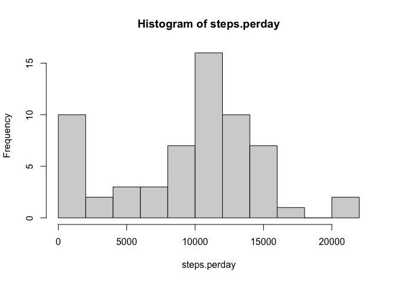

## Loading and preprocessing the data
First, load the necessary libraries

```r
library(lattice)
```
Loading the data and changing the date column from class character to class date

```r
activity.data <- read.csv("activity.csv")
str(activity.data)
```

```
## 'data.frame':	17568 obs. of  3 variables:
##  $ steps   : int  NA NA NA NA NA NA NA NA NA NA ...
##  $ date    : chr  "2012-10-01" "2012-10-01" "2012-10-01" "2012-10-01" ...
##  $ interval: int  0 5 10 15 20 25 30 35 40 45 ...
```

```r
activity.data$date <- as.Date(activity.data$date)
class(activity.data$date)
```

```
## [1] "Date"
```

## What is mean total number of steps taken per day?
Finding the total number of steps per day, make a histogram, and then calculate the mean and median

```r
steps.perday <-tapply(X=activity.data$steps, INDEX = activity.data$date, FUN = sum, na.rm=TRUE)
```
Making a histogram of the steps per day

```r
hist(steps.perday, breaks=14)
```

<!-- -->
Calculating the mean steps per day

```r
mean.steps.perday<-mean(steps.perday)
mean.steps.perday
```

```
## [1] 9354.23
```
Calculating the median steps per day

```r
median.steps.perday<-median(steps.perday)
median.steps.perday
```

```
## [1] 10395
```

## What is the average daily activity pattern?
First, calculate the average number of steps taken during any particular interval

```r
mean.steps.perinterval<-data.frame(tapply(X=activity.data$steps, INDEX=activity.data$interval, FUN=mean, na.rm=TRUE))
```
Turn the rownames (which are the intervals) into a column and make interval numeric

```r
mean.steps.perinterval$interval<-rownames(mean.steps.perinterval)
colnames(mean.steps.perinterval) <-c("mean.steps", "interval")
mean.steps.perinterval$interval <- as.numeric(mean.steps.perinterval$interval)
```
Make a line graph of the interval vs. mean number of steps across all days

```r
plot(x=mean.steps.perinterval$interval, y=mean.steps.perinterval$mean.steps, type="l", xlab="interval", ylab="mean number of steps")
```

<!-- -->
The 5 minute interval with the greatest average number of steps is...

```r
mean.steps.perinterval[mean.steps.perinterval$mean.steps==(max(mean.steps.perinterval$mean.steps)),]
```

```
##     mean.steps interval
## 835   206.1698      835
```

## Imputing missing values
Calculating the total number of rows with a NA value for steps. 

```r
sum(is.na(activity.data$steps))
```

```
## [1] 2304
```
Replacing NA values with the mean number of steps for that interval across all days

```r
activity.data.v2<-merge(activity.data, mean.steps.perinterval, by="interval", all=FALSE)

activity.data.v2.notNA <- activity.data.v2[!is.na(activity.data.v2$steps),]

activity.data.v2.NA <- activity.data.v2[is.na(activity.data.v2$steps),]
activity.data.v2.NA$steps <- activity.data.v2.NA$mean.steps

activity.data.v3 <- rbind(activity.data.v2.notNA, activity.data.v2.NA)

activity.data.v3 <- activity.data.v3[,1:3]
```
Confirming that no NA values are present in the new dataset

```r
sum(is.na(activity.data.v3$steps))
```

```
## [1] 0
```
Confirming that the dimensions are the same as prior to the NA replacement

```r
dim(activity.data)
```

```
## [1] 17568     3
```

```r
dim(activity.data.v3)
```

```
## [1] 17568     3
```
Calculating the total number of steps taken per day. 

```r
total.steps.perday <- data.frame(tapply(X=activity.data.v3$steps, INDEX=activity.data.v3$date, FUN=sum))

total.steps.perday$date <- rownames(total.steps.perday)

colnames(total.steps.perday) <- c("total.steps.per.day", "date")
```
Making a histogram of the total number of steps taken per day

```r
hist(total.steps.perday$total.steps.per.day, breaks=14)
```

<!-- -->
Calculating the mean total number of steps taken per day

```r
mean(total.steps.perday$total.steps.per.day)
```

```
## [1] 10766.19
```
Calculating the median total number of steps taken per day

```r
median(total.steps.perday$total.steps.per.day)
```

```
## [1] 10766.19
```
Replacing the NA values with the mean number of steps taken in that interval resulted in a greater mean and median number of steps taken per day than if the NA values had been left there. 

## Are there differences in activity patterns between weekdays and weekends?
Creating a new factor variable specifying the day of the week for the particular date

```r
activity.data.v3$weekday.vs.weekend<-weekdays(activity.data.v3$date, abbreviate=TRUE)
```
Replacing the day of the week with a "weekday" or "weekend" under the "weekday.vs.weekend" column

```r
activity.data.v3$weekday.vs.weekend <- gsub(pattern="Mon", replacement="weekday", x=activity.data.v3$weekday.vs.weekend )
activity.data.v3$weekday.vs.weekend <- gsub(pattern="Tue", replacement="weekday", x=activity.data.v3$weekday.vs.weekend )
activity.data.v3$weekday.vs.weekend <- gsub(pattern="Wed", replacement="weekday", x=activity.data.v3$weekday.vs.weekend )
activity.data.v3$weekday.vs.weekend <- gsub(pattern="Thu", replacement="weekday", x=activity.data.v3$weekday.vs.weekend )
activity.data.v3$weekday.vs.weekend <- gsub(pattern="Fri", replacement="weekday", x=activity.data.v3$weekday.vs.weekend )
activity.data.v3$weekday.vs.weekend <- gsub(pattern="Sat", replacement="weekend", x=activity.data.v3$weekday.vs.weekend )
activity.data.v3$weekday.vs.weekend <- gsub(pattern="Sun", replacement="weekday", x=activity.data.v3$weekday.vs.weekend )
```
#Making a panel plot containing time series plots of the 5-minute interval (x-axis) and the average (mean) number of steps taken, average across all weekday days or weekend days (y-axis). 
First, I am calculating the mean number of steps taken per interval during the weekdays

```r
activity.data.v3.weekdays <- activity.data.v3[activity.data.v3$weekday.vs.weekend=="weekday",]
mean.steps.perinterval.weekday <- data.frame(tapply(X=activity.data.v3.weekdays$steps, INDEX=activity.data.v3.weekdays$interval, FUN=mean))
mean.steps.perinterval.weekday$interval <- rownames(mean.steps.perinterval.weekday)
colnames(mean.steps.perinterval.weekday) <- c("mean.steps.per.interval", "interval")
mean.steps.perinterval.weekday$weekday.vs.weekend <- "weekday"

activity.data.v3.weekend <- activity.data.v3[activity.data.v3$weekday.vs.weekend=="weekend",]
mean.steps.perinterval.weekend <- data.frame(tapply(X=activity.data.v3.weekend$steps, INDEX=activity.data.v3.weekend$interval, FUN=mean))
mean.steps.perinterval.weekend$interval <- rownames(mean.steps.perinterval.weekend)
colnames(mean.steps.perinterval.weekend) <- c("mean.steps.per.interval", "interval")
mean.steps.perinterval.weekend$weekday.vs.weekend <- "weekend"

mean.steps.perinterval.weekday.vs.weekend <- rbind(mean.steps.perinterval.weekday, mean.steps.perinterval.weekend)
mean.steps.perinterval.weekday.vs.weekend$interval <- as.numeric(mean.steps.perinterval.weekday.vs.weekend$interval)
```
Next, I am making the line time series plots

```r
xyplot(mean.steps.per.interval~interval|weekday.vs.weekend, type="l", xlab="interval", ylab="mean number of steps", data=mean.steps.perinterval.weekday.vs.weekend)
```

<!-- -->
